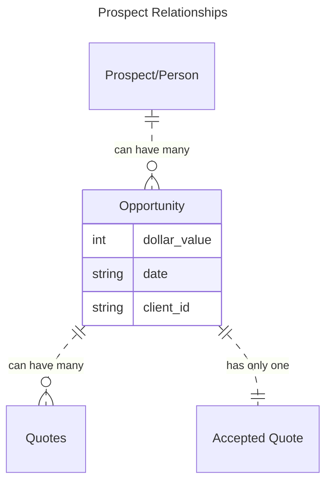

## Definitions
- __Lead:__ A time a prospect has inquired about an event.
- __Prospect:__ Someone with an opportunity to hold an event.
- __Opportunity:__ An instance of a Prospect looking to hold a specific event e.g. Mr. & Mrs. Smith's wedding.

# New Architecture
- there is now an additional file (integrator bridge)
- you will auto-login to this file
- this file holds all data for infinity/integrating with infinity
- File should be visible on list of hosted files

# Opportunities

## What is an Opportunity?
An opportunity represents an event or party that the customer wants to have catered. 
This is not currently tracked in the existing caterEvents database and we're adding this information into the Integrator Bridge.

## Why track opportunities?
1. One prospect may have multiple events they wish to cater over time. We want to keep all of these opportunities (and events) linked to a single Person record in FileMaker to make reporting possible.
2. This will make it possible to report on the overall number of opportunities we are receiving each year. 
	- This is currently difficult because the same event will be quoted many times. If we do not get the business it is difficult to report on those that we missed because, while we may have n number of quotes in the system, we don't know how many actual events those related to without a single "accepted quote"

## New Opportunity Workflow
1. [Create the opportunity record](#create-the-opportunity-record-in-filemaker-and-push-it-to-infinity)
	1. Track sales activity (e.g. calls, emails, texts) using Infinity web interface or FileMaker nextActions table
2. Create CaterEvent records to quote the opportunity
3. [link these quotes to the opportunity](associating-an-opportunity-to-a-caterevent-record)
	- this ensures that information entered into infinity is linked the correct person record in FileMaker
	- activity performed on infinity will be automatically reflected in FileMaker.
		- sub tasks/comments will be created as NextAction records
	- activity performed in FileMaker can optionally be pushed to Infinity
		- NextActions of type "Appointment" will be created as sub-tasks for your opportunity record
		- Other types of NextAction records will be created as comments under your opportunity record.
	- #todo what do we do about generic next actions? currently it's getting board/folder from the opportunity record. maybe make configurable?

## Create the Opportunity Record in FileMaker and push it to Infinity
- open Integrator Bridge file
- go to layout User > "Opportunity - Detail"
- create a new record (1)
- name your opportunity (2) 
	- this will show in Infinity
- click the magnifying glass to search for a party (3)
	- in the popover search window, enter your search criteria
	- this should be doing an "or" search where any record that matches any criteria should be returned
	- searches for names and organization names are fuzzy searches that will return other things that are spelled similarly
	- searches for names and organization names should also include exact matches.
	- select a party by clicking on their line
		- you should see their details show up in the opportunity.
- select a status, salesperson, and folder.(4-7)
- push the upload button (8) to push to infinity
	- if this is not viewable, click the background after selecting a status, salesperson, and folder.
- you should now see the opportunity show up in Infinity
- NOTE: opportunities are **ALWAYS** created from FileMaker. If you create a task in infinity, it will not be considered an opportunity.
 

### Finding people for Opportunities
- enter your search terms
- this should do an or search where any matches are included
- to filter the list of records DOWN enter your search term in the 'filter' field below and then press enter or press the button next to the field. 
- this should return any records that contain the exact text string in any of the fields.

### Creating a Person record for an opportunity
- if the person you're looking for doesn't exist you can add them to the Propect list 
	- press the "add new" person button on the Opportunity - Detail layout.
	- in the popover, enter the details of your person: name, email, phone, etc. 
	- press "add new" button at the bottom of the popover
	- your record should now be viewable in caterevents, and also associated to the currently open opportunity record.
	
## Associating an opportunity to a CaterEvent record
- from the Event Summary layout
- set today's date in the global field
- this will automatically filter out an opportunity records that have expired.
- on the far right, select the opportunity id ![[CleanShot 2023-12-13 at 14.05.01@2x.png|image]] 

## Why associate an opportunity to a CaterEvent?
- the opportunity record allows comments/activity for this opportunity to show up under the same infinity task. 

# Managing Opportunities in Infinity
## Update an opportunity from Infinity
- modify a field value on Infinity website
	- only some fields are mirred in FM:
		- opportunity status
		- due date
		- contact fields are updated, but not visible as they're not written back to people table.

## How to create a task for an opportunity through Infinity
- create a task on infinity that is a sub-item to your opportunity record.
- use the salesperson field to select which FM user this should go to.
	- [[#How to associate a salesperson to an infinity id | How to set up a new salesperson]] 
- this record should show up in FM as a next action record and associated to the correct person by their people id.

## Create a generic task through infinity
- create the task
- assign sales person ([ensure they're set up correctly](#how-to-associate-a-salesperson-to-an-infinity-id))
- record should show in nextactions table with correct fm username

# Setting Up a New Salesperson
## How to create a new folder
- create folder in infinity
- go to board map layout
- find board record
- pull folders

## How to associate a salesperson to an infinity id
- add anyone needed to the attribute in Infinity
	- modify the salesperson label attribute
	- add any salespeople we need
- pull all Salesperson label options in FileMaker
	- go to the layout
	- set the global field on the layout the exact name of the attribute you want to pull values for e.g. "Salesperson"
	- pull all records.
- pull all users in FileMaker
	- go to the layout
	- pull all records
- select a label value for each user that we want to use.
- also enter their FM user name.

